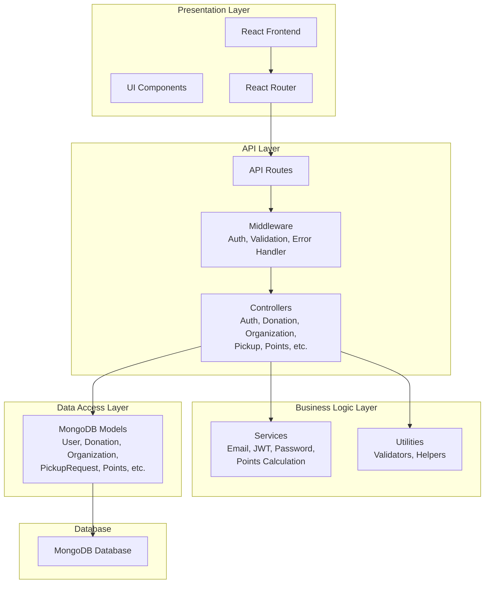

# Food Donation & Surplus Management System - Class Diagram

## UML Class Diagram

```mermaid
classDiagram
    class User {
        +uuid: String (PK)
        +first_name: String
        +last_name: String
        +email: String (Unique)
        +password_hash: String
        +phone: String (10 digits)
        +role: Enum[DONOR, NGO, VOLUNTEER, ADMIN]
        +donor_type: Enum[HOME, HOSTELS, RESTAURANTS]
        +hostel_name: String
        +restaurant_name: String
        +owner_name: String
        +address: String
        +city: String
        +state: String
        +zip_code: String
        +ngo_name: String
        +is_active: Boolean
        +is_verified: Boolean
        +profile_image_url: String
        +location: GeoJSON
        +createdAt: Date
        +updatedAt: Date
        --
        +register()
        +login()
        +updateProfile()
        +getRole()
        +getLocation()
    }

    class Donation {
        +uuid: String (PK)
        +donor: FK→User
        +organization: FK→Organization
        +food_type: String
        +food_category: Enum[COOKED, RAW, PACKAGED, BEVERAGES, DAIRY, BAKERY, FRUITS, VEGETABLES]
        +quantity: Number
        +unit: Enum[KG, LITER, PIECES, DOZEN, BOXES]
        +description: String
        +preparation_date: Date
        +expiry_date: Date
        +storage_condition: String
        +location_latitude: Number
        +location_longitude: Number
        +address: String
        +city: String
        +contact_name: String
        +contact_phone: String (10 digits)
        +contact_email: String
        +image_url: String
        +status: Enum[AVAILABLE, REQUESTED, ALLOCATED, PICKED_UP, COMPLETED, CANCELLED, EXPIRED]
        +accepted_by: {user, name, organization, role, rejected}
        +availability_count: Number
        +createdAt: Date
        +updatedAt: Date
        --
        +createDonation()
        +updateStatus()
        +acceptByNGO()
        +rejectByNGO()
        +trackDonation()
        +expireDonation()
    }

    class Organization {
        +uuid: String (PK)
        +name: String
        +organization_type: Enum[NGO, CHARITY, RESTAURANT, HOTEL, INDIVIDUAL, EVENT_ORGANIZER]
        +description: String
        +registration_number: String
        +website: String
        +email: String
        +phone: String
        +location_latitude: Number
        +location_longitude: Number
        +address: String
        +city: String
        +state: String
        +zip_code: String
        +verification_status: Enum[PENDING, APPROVED, REJECTED]
        +verified_by: FK→User
        +verified_date: Date
        +is_active: Boolean
        +registration_document_url: String
        +created_by: FK→User
        +ratings: SubDoc[rating, comment, user]
        +average_rating: Number
        +rating_count: Number
        +accepted_count: Number
        +decision_count: Number
        +acceptance_score: Number
        +createdAt: Date
        +updatedAt: Date
        --
        +registerOrganization()
        +submitForVerification()
        +acceptDonation()
        +rejectDonation()
        +updateRating()
        +calculateAcceptanceScore()
    }

    class PickupRequest {
        +uuid: String (PK)
        +donation: FK→Donation
        +receiver: FK→User
        +organization: FK→Organization
        +requested_quantity: Number
        +status: Enum[PENDING, CONFIRMED, PICKED_UP, CANCELLED, REJECTED]
        +pickup_date: Date
        +pickup_time: Time
        +special_instructions: String
        +rejection_reason: String
        +completed_at: Date
        +createdAt: Date
        +updatedAt: Date
        --
        +createPickupRequest()
        +confirmPickup()
        +pickupDonation()
        +cancelPickup()
        +rejectPickup()
        +completePickup()
    }

    class Points {
        +uuid: String (PK)
        +user_id: FK→User
        +transaction_type: Enum[DONATION, PICKUP, VOLUNTEER_ACTIVITY, REDEMPTION, BONUS, ADJUSTMENT]
        +points: Number
        +description: String
        +related_donation_id: FK→Donation
        +related_pickup_request_id: FK→PickupRequest
        +reference_id: String
        +is_reversed: Boolean
        +reversal_reason: String
        +reversed_at: Date
        +metadata: Mixed
        +createdAt: Date
        +updatedAt: Date
        --
        +addPoints()
        +redeemPoints()
        +reverseTransaction()
        +calculateUserPoints()
        +getPointsHistory()
    }

    class Notification {
        +uuid: String (PK)
        +user: FK→User
        +type: Enum[DONATION_AVAILABLE, DONATION_ACCEPTED, DONATION_REJECTED, REQUEST_RECEIVED, PICKUP_CONFIRMED, DONATION_PICKED, RATING_RECEIVED, ORGANIZATION_APPROVED, ORGANIZATION_REJECTED, NEW_MESSAGE]
        +title: String
        +message: String
        +related_entity_id: FK→Related
        +related_entity_type: String[Donation, Pickup, Message]
        +is_read: Boolean
        +action_url: String
        +metadata: Mixed
        +createdAt: Date
        +updatedAt: Date
        --
        +createNotification()
        +markAsRead()
        +sendNotification()
        +getUserNotifications()
    }

    class Message {
        +uuid: String (PK)
        +sender: FK→User
        +receiver: FK→User
        +related_donation: FK→Donation
        +related_request: FK→PickupRequest
        +message_text: String
        +is_read: Boolean
        +read_at: Date
        +createdAt: Date
        +updatedAt: Date
        --
        +sendMessage()
        +markAsRead()
        +getConversation()
        +deleteMessage()
    }

    class ActivityLog {
        +uuid: String (PK)
        +user: FK→User
        +donation: FK→Donation
        +action: Enum[CREATED, ACCEPTED, REJECTED, PICKED_UP, COMPLETED, CANCELLED]
        +description: String
        +details: Mixed
        +createdAt: Date
        +updatedAt: Date
        --
        +logActivity()
        +getActivityHistory()
        +getUserActivity()
        +getDonationActivity()
    }

    class Rating {
        +uuid: String (PK)
        +rater: FK→User
        +rated_user: FK→User
        +donation: FK→Donation
        +request: FK→PickupRequest
        +rating: Number (1-5)
        +review_text: String
        +createdAt: Date
        +updatedAt: Date
        --
        +submitRating()
        +updateRating()
        +getAverageRating()
        +getUserRatings()
    }

    class Analytics {
        +uuid: String (PK)
        +date: Date
        +total_donations: Number
        +total_food_collected: Number
        +active_users: Number
        +active_organizations: Number
        +total_points_issued: Number
        +completions_count: Number
        --
        +calculateDailyStats()
        +generateReport()
        +trackMetrics()
    }

    %% Relationships
    User "1" --> "*" Donation : creates
    User "1" --> "*" PickupRequest : makes
    User "1" --> "*" Points : earns
    User "1" --> "*" Message : sends
    User "1" --> "*" Message : receives
    User "1" --> "*" Notification : receives
    User "1" --> "*" Rating : gives
    User "1" --> "*" Rating : receives
    User "1" --> "*" ActivityLog : performs

    Donation "1" --> "*" PickupRequest : has
    Donation "1" --> "*" Message : referenced_in
    Donation "1" --> "*" ActivityLog : tracked_in
    Donation "1" --> "*" Rating : rated_for
    Donation "1" --> "*" Points : generates

    Organization "1" --> "*" Donation : accepts
    Organization "1" --> "*" User : registered_with
    Organization "1" --> "*" PickupRequest : processes
    Organization "1" --> "*" Rating : receives

    PickupRequest "1" --> "*" Message : referenced_in
    PickupRequest "1" --> "*" Points : generates
    PickupRequest "1" --> "*" ActivityLog : tracked_in
    PickupRequest "1" --> "*" Rating : rated_for

    Notification "1" --> "*" ActivityLog : based_on
```

## Architecture Overview

### Layer Structure



## Entity Relationships Summary

| From | To | Type | Description |
|------|----|----|-------------|
| User | Donation | 1:N | User creates donations |
| User | PickupRequest | 1:N | User makes pickup requests |
| User | Points | 1:N | User earns points |
| User | Message | 1:N | User sends/receives messages |
| User | Rating | 1:N | User gives/receives ratings |
| User | Notification | 1:N | User receives notifications |
| User | ActivityLog | 1:N | User performs activities |
| Donation | PickupRequest | 1:N | Donation has multiple pickup requests |
| Donation | Points | 1:N | Donation generates points |
| Organization | Donation | 1:N | Org accepts donations |
| Organization | PickupRequest | 1:N | Org processes pickup requests |
| PickupRequest | Points | 1:N | Pickup generates points |

## Role-Based Access Matrix

| Role | Create | Accept/Reject | Pickup | Points | Admin |
|------|--------|---------------|--------|--------|-------|
| DONOR | Donation | - | - | Earn | - |
| NGO | - | Donation | - | - | - |
| VOLUNTEER | - | - | Request | Earn | - |
| ADMIN | - | Organization | - | Issue | Full |

## Key Features Mapping

| Feature | Primary Models | Controllers |
|---------|---|---|
| Donation Workflow | Donation, User, Organization | donationController |
| Pickup Coordination | PickupRequest, Donation, User | pickupController |
| Points System | Points, User, Donation | pointsController |
| Notifications | Notification, User | notificationController |
| Organization Management | Organization, User | organizationController |
| User Authentication | User | authController |
| Admin Dashboard | Analytics, User, Organization | adminController |
| Messaging | Message, User, Donation | messageController |
| Ratings | Rating, User | ratingController |
